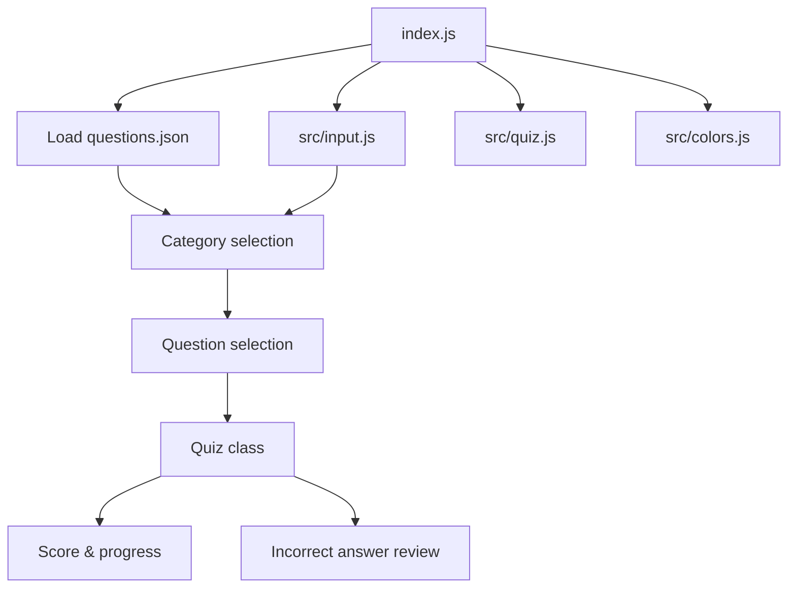

# Quiz CLI

An interactive command-line quiz game built with Node.js. The application loads multiple-choice questions from a local JSON file, lets the user choose a category and question count, and then runs a quiz session with score tracking and answer review.

## Project Overview

This repository contains a simple educational CLI app for practicing JavaScript, Node.js, and general programming concepts.

The app:

- Displays a terminal banner with ANSI colors
- Lets the user choose a quiz category
- Lets the user choose how many questions to answer
- Randomizes question order
- Tracks score and progress
- Shows explanations and a review of incorrect answers

## Technology Stack

| Area | Technology |
| --- | --- |
| Runtime | Node.js `>=18.0.0` |
| Module system | ES Modules (`"type": "module"`) |
| CLI input | Built-in `node:readline` |
| File I/O | Built-in `node:fs/promises` |
| Packaging | npm |
| License | MIT |

The repository does not use any third-party runtime dependencies.

## Architecture

The application is organized as a small CLI flow:

1. `index.js` starts the program.
2. `data/questions.json` is loaded from disk.
3. `src/input.js` handles terminal prompts and selections.
4. `src/quiz.js` contains quiz state, scoring, randomization, and result rendering.
5. `src/colors.js` formats terminal output using ANSI escape codes.

### Architecture Diagram



## Project Structure

```text
.
├── index.js
├── package.json
├── data/
│   └── questions.json
└── src/
    ├── colors.js
    ├── input.js
    └── quiz.js
```

## Features

- Category-based quiz sessions
- Configurable question count per run
- Randomized question order
- Multiple-choice answer selection
- Correct/incorrect feedback
- Explanations shown after each question
- Final score summary with performance message
- Review of missed questions
- Terminal color styling with ANSI escape codes

## Prerequisites

- Node.js 18 or newer
- npm

## Setup

1. Clone the repository.
2. Change into the project directory:

```bash
cd test-app
```

3. Install dependencies:

```bash
npm install
```

> Note: `package.json` does not declare external dependencies, so this step mainly prepares the project in the standard npm workflow.

## Running the Application

Start the quiz with:

```bash
npm start
```

or run the entry file directly:

```bash
node index.js
```

## Usage

When the app starts, you will be prompted to:

1. Choose a quiz category
2. Choose the number of questions
3. Answer each question by entering the option number
4. Review your score and any incorrect answers
5. Decide whether to play again

Example interaction:

```text
Choose a category:
  1. JavaScript Basics
  2. Node.js Fundamentals
  3. General Programming

How many questions?
  1. All questions
  2. 3 questions
  3. 5 questions
```

## Configuration

The quiz content is stored in:

- `data/questions.json`

Each category includes:

- `name`: Display name for the category
- `questions`: Array of question objects

Each question object includes:

- `question`: The prompt shown to the user
- `options`: Array of answer choices
- `answer`: Zero-based index of the correct option
- `explanation`: Optional explanation shown after answering

### Questions Data Format

```json
{
  "categories": {
    "categoryId": {
      "name": "Category Name",
      "questions": [
        {
          "question": "Question text",
          "options": ["A", "B", "C", "D"],
          "answer": 2,
          "explanation": "Why the answer is correct"
        }
      ]
    }
  }
}
```

## Testing

The repository defines an npm test script:

```bash
npm test
```

This runs:

```bash
node --test
```

No test files are present in the repository snapshot provided here, so `npm test` may complete without executing any actual test cases.

## Build

There is no separate build step in the repository.

## Docker

Not specified in the repository.

## CI/CD

Not specified in the repository.

## Database

Not applicable. The application stores quiz content in a local JSON file and does not use a database.

## API Documentation

Not applicable. This is a CLI application and does not expose HTTP endpoints.

## Authentication & Authorization

Not specified in the repository. The application does not implement authentication or authorization.

## Logging & Error Handling

- The main entrypoint wraps startup logic in a `try/catch` block.
- Unexpected errors are printed to the console with a stack trace.
- The process exits with status code `1` on fatal startup errors.

## Contributing

No contribution guidelines were found in the repository.

## License

This project is licensed under the MIT License.

## Notes for Developers

- The quiz uses a Fisher-Yates shuffle to randomize question order.
- Category and question counts are derived from the contents of `questions.json`.
- Terminal colors are implemented with plain ANSI escape codes, so no extra packages are required.
